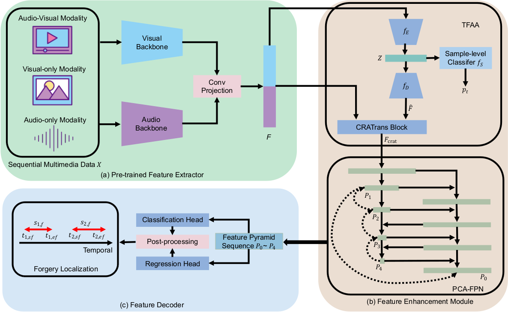
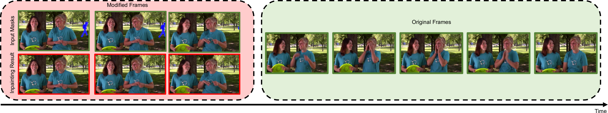
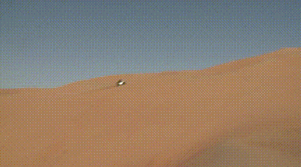
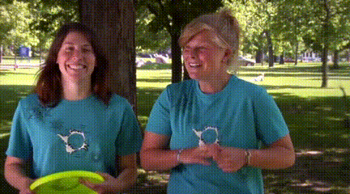

<div align="center">

## **\[ACM MM'23\] UMMAFormer**: A Universal Multimodal-adaptive Transformer Framework For Temporal Forgery Localization

<a href="https://pytorch.org/get-started/locally/"></a>
[](https://www.acmmm2023.org/)


<a href="https://paperswithcode.com/sota/temporal-forgery-localization-on-lav-df?p=ummaformer-a-universal-multimodal-adaptive-1">
    
</a>

<!-- [](https://github.com/nku-shengzheliu/SER30K/blob/main/LICENSE) -->

</div>


<div align=center>
    <a href="https://ymhzyj.github.io/" target="_blank">Rui Zhang</a>
    <!-- Rui Zhang -->
    <a href="https://ccs.scu.edu.cn/info/1052/2601.htm" target="_blank">Hongxia wang</a>
    Mingshan Du
    Hanqing Liu
    Yang Zhou
    Qiang Zeng
</div>
<div align=center>
School of Cyber Science and Engineering, Sichuan University
</div>

**Temporal Video Inpainting Localization(TVIL) dataset** and pytorch training/validation code for **UMMAFormer**. This is the official repository of our Work accepted to ACM MM'23. If you have any question, please contact _zhangrui1997[at]stu.scu.edu.cn_. The paper can be found in [arxiv](https://arxiv.org/abs/2308.14395)　or [ACM MM](https://dl.acm.org/doi/abs/10.1145/3581783.3613767).

<p align="center">

    <h4 align="center">Overview of UMMAFormer</h4>
</p>


## Abstract

The emergence of  artificial intelligence-generated content~(AIGC) has raised concerns about the authenticity of multimedia content in various fields. Existing research has limitations and is not widely used in industrial settings, as it is only focused on binary classification tasks of complete videos. We propose a novel universal transformer framework for temporal forgery localization (TFL) called UMMAFormer, which predicts forgery segments with multimodal adaptation. We also propose a Temporal Feature Abnormal Attention (TFAA) module based on temporal feature reconstruction to enhance the detection of temporal differences. In addition, we introduce a parallel cross-attention feature pyramid network (PCA-FPN) to optimize the Feature Pyramid Network (FPN) for subtle feature enhancement. To address the lack of available datasets, we introduce a novel temporal video inpainting localization (TVIL) dataset that is specifically tailored for video inpainting scenes. Our experiments demonstrate that our proposed method achieves state-of-the-art performance on benchmark datasets, Lav-DF, TVIL, Psynd surpassing the previous best results significantly.

<p align="center">

    <h4 align="center">Movitation of UMMAFormer</h4>
</p>


## TVIL dataset

### a. Data Download
If you need the TVIL dataset for academic purposes, please download the full data from [BaiduYun Disk](https://pan.baidu.com/s/1h3sHu56z3slJnPCH47QRsg?pwd=8tj1) (8tj1) or [OneDrive](https://1drv.ms/f/s!AgVmq0AY0Su8grknz_DKYQN2IbA63Q?e=hi5mbj).

### b. Data Sources
The raw data is coming from [Youtube VOS 2018](https://codalab.lisn.upsaclay.fr/competitions/7685#participate-get_data).

<!-- 原图 -->

### c. Inpainting Methods
We use four different video inpainting methods to create new videos. They are [E2FGVI](https://github.com/MCG-NKU/E2FGVI), [FGT](https://github.com/hitachinsk/FGT), [FuseFormer](https://github.com/ruiliu-ai/fuseformer), and [STTN](https://github.com/researchmm/STTN), respectively. We used [XMEM](https://github.com/hkchengrex/XMem) to generate the inpainting mask.






### d. Feature Extract
We also provided [TSN features](https://pan.baidu.com/s/1h3sHu56z3slJnPCH47QRsg?pwd=8tj1) (code：8tj1) as used in the paper, specifically extracted by [mmaction2==0.24.1](https://github.com/open-mmlab/mmaction2).


## Code

### Requirements

- Linux
- Python 3.5+
- PyTorch 1.11
- TensorBoard
- CUDA 11.0+
- GCC 4.9+
- NumPy 1.11+
- PyYaml
- Pandas
- h5py
- joblib
- einops


### Compilation

Part of NMS is implemented in C++. The code can be compiled by

```shell
cd ./libs/utils
python setup.py install --user
cd ../..
```

The code should be recompiled every time you update PyTorch.

### To Reproduce Our Results

1. Download Features and Annotations
    We provided the following features and annotations for download:
    
    annotations and features of Lav-DF from [BaiduYun](https://pan.baidu.com/s/1GGwfkjjYlBtQyB4uVU38mA?pwd=k6jq) (code：k6jq) or [OneDrive](https://1drv.ms/f/s!AgVmq0AY0Su8gr05BrQEdS2BE9f75A?e=8L9GFk)

    annotations and features of Psynd from [BaiduYun](https://pan.baidu.com/s/1CgkDNeisV9HtfqEzzYyIhQ?pwd=m6iq) (code：m6iq) or [OneDrive](https://1drv.ms/f/s!AgVmq0AY0Su8gv5hWzRE2sWkumDcCA?e=GSPe2z)

    annotations and features of TVIL from [BaiduYun Disk](https://pan.baidu.com/s/1h3sHu56z3slJnPCH47QRsg?pwd=8tj1) (8tj1) or [OneDrive](https://1drv.ms/f/s!AgVmq0AY0Su8grknz_DKYQN2IbA63Q?e=hi5mbj)

    These features are the same as those used in our paper and are extracted using the bylo-a and tsn models. They can be directly used for training and testing. The labels, on the other hand, have been converted from their original different forms to fit the format of our code. The ground truth values remain unchanged and are the same as the original ones.

    **optional**

    _You also can extract features on your own using [mmaction==0.24.1](https://github.com/open-mmlab/mmaction2) and [BYOL-A](https://github.com/nttcslab/byol-a). First, you need to apply to the official source for the original datasets from [Lav-DF](https://github.com/ControlNet/LAV-DF) and [Psynd](https://scholarbank.nus.edu.sg/handle/10635/227398). Then you need to download [mmaction==0.24.1](https://github.com/open-mmlab/mmaction2) and [BYOL-A](https://github.com/nttcslab/byol-a) and set up the environment following official instructions. Furthermore, you need to extract frames and optical flow from the videos. You can use mmaction for this purpose. In the case of Lav-DF, you also need to separate the corresponding audio from the original video. And The pre-trained model also needs to be downloaded from [tsn_rgb](https://download.openmmlab.com/mmaction/recognition/tsn/tsn_r50_320p_1x1x8_50e_activitynet_clip_rgb/tsn_r50_320p_1x1x8_50e_activitynet_clip_rgb_20210301-c0f04a7e.pth) and [tsn_flow](https://download.openmmlab.com/mmaction/recognition/tsn/tsn_r50_320p_1x1x8_150e_activitynet_clip_flow/tsn_r50_320p_1x1x8_150e_activitynet_clip_flow_20200804-8622cf38.pth)._
    _You can use the following command to generate a video list txt file for Lav-DF and extract visual features._
    ```shell
    python tools/gen_lavdf_filelist.py
    bash tools/gen_tsn_features_lavdf.sh
    ```

    _For audio features, please put the code tools/byola_extract_lavdf.py in the BYOL-A directory and use following command._
    ```shell
    python bylo-a/byola_extract_lavdf.py
    ```

2. Unpack Features and Annotations

* Unpack the file under *./data* (or elsewhere and link to *./data*).
* The folder structure should look like
```
This folder
│   README.md
│   ...  
│
└───data/
│    └───lavdf/
│    │	 └───annotations
│    │	 └───feats   
│    │	 　　　└───byola   
│    │	 　　　   └───train   
│    │	 　　　   └───dev   
│    │	 　　　   └───test   
│    │	 　　  └───tsn   
│    │	 　　　   └───flow
│    │	 　　　      └───train   
│    │	 　　　      └───dev   
│    │	 　　　      └───test  
│    │	         └───rgb
│    │	 　　　      └───train   
│    │	 　　　      └───dev   
│    │	 　　　      └───test
│    └───...
|
└───libs
│
│   ...
```

3. Training and Evaluation
   Train our UMMAFormer with TSN and BYOL-A features. This will create an experiment folder _./paper_results_ that stores training config, logs, and checkpoints.
    ```shell
    python ./train.py ./configs/UMMAFormer/dataset.yaml
    ```
   Then you can run the evaluation process using the loaded model and evaluation dataset.
    ```shell
    python ./eval.py ./configs/UMMAFormer/dataset.yaml ./paper_results/dataset/model_best.pth.tar
    ```
    To modify the configuration file for psynd, you need to change the value of "test_split" to the corresponding subset name, such as "test_cellular" or "test_landline."　For each subset, you can calculate IoU for each subset using the following command:
    ```shell
    python tools/test_miou.py
    ```
    You need to modify the 'split' variable in the code, as well as the addresses of the labels and results.
4. Evaluating Our Pre-trained Model
   We also provide a pre-trained models. The following link is for Baidu cloud drive. Considering that some users may not be able to access it, we have additionally provided a [OneDrive link](https://1drv.ms/u/s!AgVmq0AY0Su8grtFydwbVa-fdxMdmQ?e=H71mMB).

| Dataset        | Modal | Config | Pretrained |  AP@0\.5 |  AP@0\.75 | AP@0\.95 | AR@10    | AR@20  |  AR@50 | AR@100 |
|----------------|-------|--------|------------|----------|-----------|----------|----------|--------|--------|--------|
| Lav\-DF        | V     | [Yaml](./configs/UMMAFormer/lavdf_tsn.yaml)   | [Ckpt](https://pan.baidu.com/s/1oL2BVmBZ4Bk3FQ7qg9Rv6Q?pwd=9rhd)       | 97\.30   | 92\.96    | 25\.68   | 90\.19   | 90\.85 | 91\.14 | 91\.18 |
| Lav\-DF        | V\+A  | [Yaml](./configs/UMMAFormer/lavdf_tsn_byola.yaml)   | [Ckpt](https://pan.baidu.com/s/1gjhiAi7pdGJ8ml-lct4nkw?pwd=gms3)       | 98\.83   | 95\.54    | 37\.61   | 92\.10   | 92\.42 | 92\.47 | 92\.48 |
| Lav\-DF Subset | V     | [Yaml](./configs/UMMAFormer/lavdfvm_tsn.yaml)   | [Ckpt](https://pan.baidu.com/s/18h8FIc6-lzCl0lNBjVD3fA?pwd=ju3r)       | 98\.83   | 95\.95    | 30\.11   | 92\.32   | 92\.65 | 92\.74 | 92\.75 |
| Lav\-DF Subset | V\+A  | [Yaml](./configs/UMMAFormer/lavdfvm_tsn_byola.yaml)   | [Ckpt](https://pan.baidu.com/s/1WLtze3rgRl8Is_5azZ-WQw?pwd=axn5)  | 98\.54   | 94\.30    | 37\.52   | 91\.61   | 91\.97 | 92\.06 | 92\.06 |
| TVIL           | V     | [Yaml](./configs/UMMAFormer/tvil_tsn.yaml)   | [Ckpt](https://pan.baidu.com/s/1_YFse6-Bvhlqb_JrzbMPPg?pwd=dmra)       | 88\.68   | 84\.70    | 62\.43   | 87\.09   | 88\.21 | 90\.43 | 91\.16 |
| Psynd\-Test    | A     | [Yaml](./configs/UMMAFormer/psynd_byola.yaml)   | [Ckpt](https://pan.baidu.com/s/1sgNVaITzXz0qVQgSj0vf0A?pwd=ndh6)       | 100\.00  | 100\.00   | 79\.87   | 97\.60   | 97\.60 | 97\.60 | 97\.60 |


## Results


## TODO List
- [x] Release full code.
- [x] Release TVIL datasets and TSN features.
- [x] Release TSN features and BYOL-A features for Lav-DF and Psynd 
- [x] Release our pre-trained model


## Cite UMMAFormer

```shell
@inproceedings{DBLP:conf/mm/ZhangWDLZZ23,
  author       = {Rui Zhang and
                  Hongxia Wang and
                  Mingshan Du and
                  Hanqing Liu and
                  Yang Zhou and
                  Qiang Zeng},
  title        = {UMMAFormer: {A} Universal Multimodal-adaptive Transformer Framework
                  for Temporal Forgery Localization},
  booktitle    = {Proceedings of the 31st {ACM} International Conference on Multimedia,
                  {MM} 2023, Ottawa, ON, Canada, 29 October 2023- 3 November 2023},
  pages        = {8749--8759},
  publisher    = {{ACM}},
  year         = {2023},
  url          = {https://doi.org/10.1145/3581783.3613767},
  doi          = {10.1145/3581783.3613767},
}
```

## Acknowledgement

Thanks for the work of [Actionformer](https://github.com/happyharrycn/actionformer_release). Our code is based on the implementation of them.
